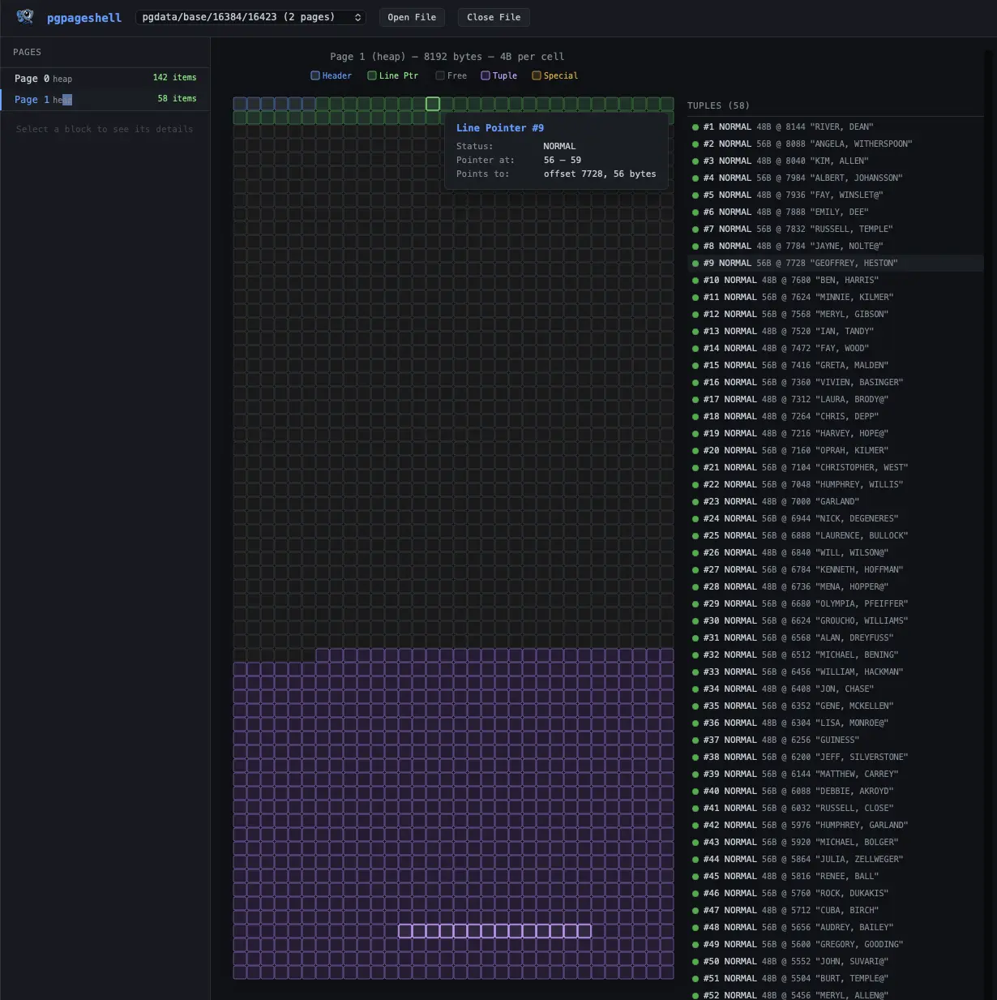

<div align="center">
  

  # pgpageshell

  [](https://app.ona.com/#https://github.com/jespino/pgpageshell)

  A desktop application for inspecting PostgreSQL data files at the page level.

  **[Try it online](https://jespino.github.io/pgpageshell/)** — no installation needed, pre-loaded with the [Pagila](https://github.com/devrimgunduz/pagila) sample database.
</div>

PostgreSQL stores all table and index data in 8 KB pages on disk. These pages
have a well-defined binary format — headers, line pointers, tuple data, MVCC
metadata, index-specific structures — but there's no built-in way to look at
them directly. `pgpageshell` lets you open any PostgreSQL data file and
navigate through its pages, examining the raw structure that underlies every
query.

<div align="center">
  <a href="https://leanpub.com/deep-dive-into-a-sql-query">
    
  </a>
</div>

This tool is part of the companion material for
[**Deep dive into a SQL query**](https://leanpub.com/deep-dive-into-a-sql-query),
a book that follows a SQL statement through every stage of PostgreSQL's
internal pipeline — from parsing to execution — and explains how data is
organized on disk along the way.

## Further Reading

For background on how PostgreSQL organizes data on disk — slotted pages,
heap tuples, and the different index access methods — see
[**PostgreSQL Indexes**](https://internals-for-interns.com/posts/postgres-indexes/)
on *Internals for Interns*.

## Tutorial

See [**TUTORIAL.md**](TUTORIAL.md) for a hands-on walkthrough that uses the
Pagila sample database to explore heap pages, B-tree indexes, Hash indexes,
GiST, GIN, and BRIN — all from the perspective of raw page data.

## Installation

### Debian / Ubuntu

Download the `.deb` package from the [latest release](https://github.com/jespino/pgpageshell/releases/latest) and install it:

```bash
sudo dpkg -i pgpageshell_*.deb
```

### RPM (Fedora / RHEL)

```bash
sudo rpm -i pgpageshell_*.rpm
```

### Binary download

Pre-built binaries for Linux (amd64 and arm64) and Windows (amd64) are
available on the [releases page](https://github.com/jespino/pgpageshell/releases/latest).
Download the archive for your platform, extract it, and place the binary in
your `PATH`. For macOS, build from source (see below).

### Building from source

Requires Go 1.22+, Node.js 20+, and pnpm. [Wails v2](https://wails.io/) must
be installed for the desktop build.

```bash
# Install Wails CLI (if not already installed)
go install github.com/wailsapp/wails/v2/cmd/wails@latest

# Build the desktop application
make
```

## Usage

### Desktop application (default)

```bash
# Launch with no files — opens a welcome screen with an "Open File" button
./pgpageshell

# Launch with one or more files pre-loaded
./pgpageshell /var/lib/postgresql/data/base/16384/17543
./pgpageshell file1 file2 file3
```

The GUI displays a page grid (32×64 cells, 4 bytes each) with color-coded
regions: header (blue), line pointers (green), tuples (purple), free space
(gray), and special (orange). Index meta pages, hash bitmap pages, and BRIN
revmap pages use dedicated colors (gold, cyan, purple) and show per-field
detail on hover — each cell displays the struct field name and decoded value.

Hovering a cell highlights related elements (e.g., a line pointer and its
corresponding tuple). The sidebar lists pages and shows details for the
selected element. The legend adapts to show only the region types present on
the current page.

You can open additional files or close existing ones from the toolbar at any
time.

<div align="center">
  
</div>

You can find the file path for a table or index with:

```sql
SELECT pg_relation_filepath('my_table');
-- Returns something like: base/16384/17543
```

### Export to JSON

Export page data as JSON for use with the static web version or external tools:

```bash
./pgpageshell --export-json file1 file2 > data.json

# Use custom display names
./pgpageshell --export-json "actor=/path/to/16423" "actor_pkey (btree)=/path/to/16606" > data.json
```

### Interactive shell

```bash
./pgpageshell --shell <postgres-data-file>
```

The shell provides text-based inspection of page internals:

| Command | Description |
|---------|-------------|
| `page <n>` | Select a page by number (0-based) |
| `cat` | Hex dump of the entire 8192-byte page |
| `format` | ASCII art visualization of page regions |
| `info` | Decoded page header and special region data |
| `data` | Line pointer table and decoded tuple data |
| `pages` | Summary of all pages in the file |
| `help` | Show command list |
| `quit` | Exit |

## Supported Page Types

`pgpageshell` auto-detects the page type from the special region and decodes
it accordingly:

| Type | Detection | Special Region Contents |
|------|-----------|------------------------|
| **Heap** | No special space | — |
| **B-tree** | 16-byte special, valid btpo_flags | prev/next sibling, level, flags. Meta pages show per-field detail (magic, root, level, fastroot). Internal pages show child block pointers. |
| **Hash** | 16-byte special, page_id = `0xFF80` | prev/next block, bucket number, page type. Meta pages show per-field detail (magic, ntuples, fill factor, masks, spares, mapp). Bitmap pages show per-word bit counts. |
| **GiST** | 16-byte special, page_id = `0xFF81` | NSN, rightlink, flags (leaf/deleted/follow-right). |
| **GIN** | 8-byte special, valid flags | Rightlink, maxoff, flags (data/leaf/meta/list/compressed). Meta pages show per-field detail (pending list, entry/data page counts, nEntries). |
| **SP-GiST** | 8-byte special, page_id = `0xFF82` | Flags (meta/deleted/leaf/nulls), redirect and placeholder counts. Meta pages show per-field detail (magic, lastUsedPages cache). |
| **BRIN** | 8-byte special, type = `0xF091`–`0xF093` | Flags, page type (meta/revmap/regular). Meta pages show per-field detail (magic, version, pages-per-range). Revmap pages show per-entry (block, offset) targets. |

## License

MIT
