# Tutorial: Exploring PostgreSQL Pages with pgpageshell

This tutorial walks you through how PostgreSQL stores data on disk at the page
level. You will set up a PostgreSQL instance with the Pagila sample database,
create different index types, and use pgpageshell's GUI to visually inspect
the raw pages.

By the end you will understand:

- How heap (table) pages are structured: header, line pointers, tuples, free space.
- How each tuple carries MVCC metadata (xmin, xmax, infomask).
- How B-tree, Hash, GiST, GIN, and BRIN index pages differ from heap pages.
- How to read raw page data and connect it back to SQL-level concepts.

## 1. Setting Up the Environment

### 1.1 Start PostgreSQL with Docker

We use a Docker volume so we can access the raw data files from outside the
container:

```bash
mkdir -p pgdata

docker run -d --name pgpagila \
  -e POSTGRES_PASSWORD=secret \
  -v $(pwd)/pgdata:/var/lib/postgresql/data \
  postgres:18

# Wait for it to be ready
docker exec pgpagila pg_isready -U postgres
```

### 1.2 Load the Pagila Database

Download the Pagila schema and data, then load them:

```bash
curl -sL -o /tmp/pagila-schema.sql \
  https://raw.githubusercontent.com/devrimgunduz/pagila/master/pagila-schema.sql
curl -sL -o /tmp/pagila-data.sql \
  https://raw.githubusercontent.com/devrimgunduz/pagila/master/pagila-data.sql

docker exec pgpagila psql -U postgres -c "CREATE DATABASE pagila;"
cat /tmp/pagila-schema.sql | docker exec -i pgpagila psql -U postgres -d pagila
cat /tmp/pagila-data.sql   | docker exec -i pgpagila psql -U postgres -d pagila
```

### 1.3 Create Additional Index Types

Pagila ships with B-tree indexes and one GiST index. Let's add Hash, GIN, and
BRIN indexes so we can compare all the major types:

```sql
-- Connect to pagila
-- docker exec -it pgpagila psql -U postgres -d pagila

-- Hash index on customer email (equality lookups only)
CREATE INDEX idx_hash_customer_email ON customer USING hash (email);

-- GIN index on film full-text search column
CREATE INDEX idx_gin_film_fulltext ON film USING gin (fulltext);

-- BRIN index on rental_id (works well on naturally ordered data)
CREATE INDEX idx_brin_rental_id ON rental USING brin (rental_id);

-- Flush everything to disk
CHECKPOINT;
```

### 1.4 Locate the Data Files

Every table and index is stored as one or more files under the data directory.
Use `pg_relation_filepath` to find them:

```sql
SELECT c.relname, am.amname, pg_relation_filepath(c.oid) AS filepath
FROM pg_class c
LEFT JOIN pg_am am ON c.relam = am.oid
WHERE c.relnamespace = 'public'::regnamespace
  AND c.relname IN (
    'actor',                    -- heap table
    'actor_pkey',               -- btree index
    'idx_hash_customer_email',  -- hash index
    'film_fulltext_idx',        -- gist index
    'idx_gin_film_fulltext',    -- gin index
    'idx_brin_rental_id'        -- brin index
  )
ORDER BY am.amname;
```

The actual OIDs will differ on your system. The files live under
`pgdata/base/<database_oid>/`.

> **Note**: If PostgreSQL is running, the files are still readable. PostgreSQL
> uses shared buffers and does not hold exclusive locks on the data files. You
> can safely read them while the server is up.

---

## 2. Opening Files in pgpageshell

Launch pgpageshell and open the actor table file. You can either pass it on
the command line or use the "Open File" button from the welcome screen:

```bash
./pgpageshell pgdata/base/16384/17543
```


The sidebar on the left lists all pages in the file. The main area shows the
page grid — a 32×64 grid where each cell represents 4 bytes of the page.

---

## 3. Understanding the Page Grid

The grid is color-coded by region:

- **Blue** — Page header (24 bytes, the first 6 cells)
- **Purple** — Line pointers (4 bytes each, one cell per pointer)
- **Gray** — Free space
- **Green** — Tuples (heap rows or index entries)
- **Orange** — Special region (index-specific metadata at the end of the page)

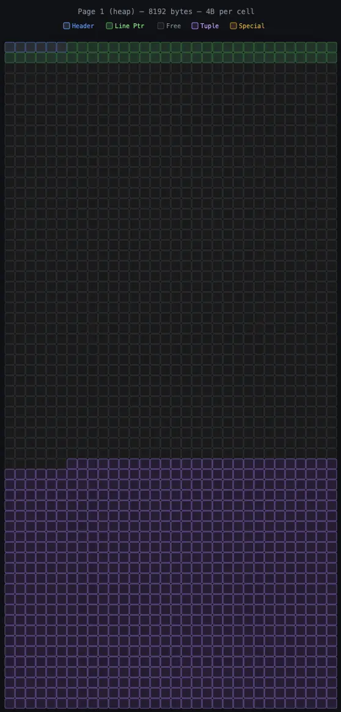

Each cell is 4 bytes, and the grid reads left-to-right, top-to-bottom — just
like reading a hex dump. The entire 8192-byte page maps to 2048 cells arranged
in a 32×64 grid.

---

## 4. Heap Pages (Tables)

Select page 0 of the actor table. This is a heap page holding actor rows.

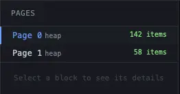

### 4.1 Page Header

Click on any blue cell in the first row. The detail panel in the sidebar shows
the page header fields:

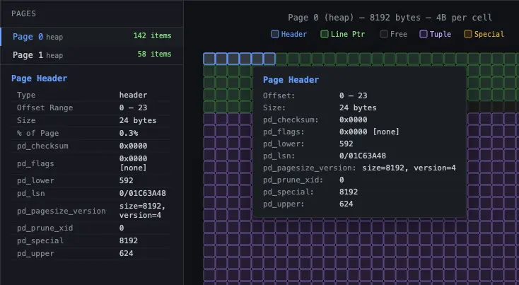

Key fields:

| Field | Meaning |
|-------|---------|
| `pd_lsn` | WAL position of the last change to this page. Used for crash recovery. |
| `pd_lower` | Byte offset where line pointers end. |
| `pd_upper` | Byte offset where tuple data starts. |
| `pd_special` | Start of special space. Equal to 8192 for heap pages (no special region). |

The gap between `pd_lower` and `pd_upper` is the free space — visible as the
gray cells in the grid.

### 4.2 Line Pointers and Tuples

Hover over a purple green (line pointer). Notice how the corresponding purple 
cells (the tuple it points to) light up simultaneously. This cross-highlighting
shows the connection between a line pointer and its tuple.

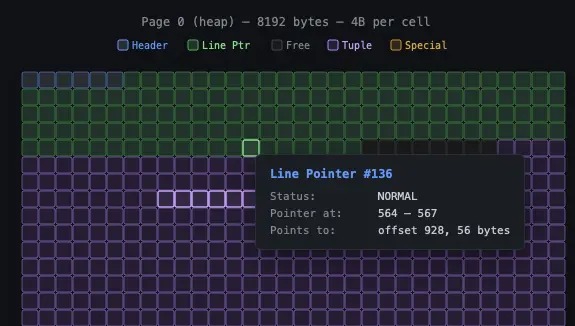

Click on a tuple in the items panel on the right to see its details:

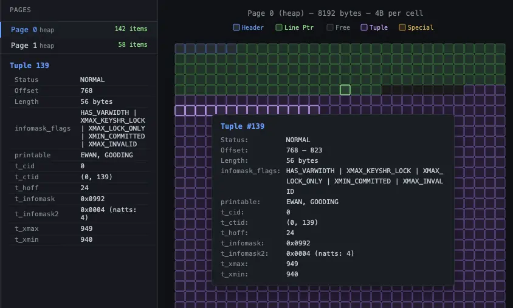

Each heap tuple has a header with MVCC metadata:

| Field | Meaning |
|-------|---------|
| `t_xmin` | Transaction ID that inserted this row. |
| `t_xmax` | Transaction that deleted or locked this row. |
| `t_ctid` | Physical location (page, line pointer). Points to itself for live tuples, or to the next version in an update chain. |
| `t_infomask` | Visibility flags: `XMIN_COMMITTED`, `XMAX_INVALID`, `HOT_UPDATED`, etc. |
| `t_hoff` | Offset where user data starts within the tuple. |

### 4.3 Page Fullness

Look at how much gray (free space) is visible in the grid. Page 0 of the actor
table is nearly full — most of the page is green (tuples) and purple (line
pointers), with only a thin strip of gray in between.

Now click on page 1 in the sidebar. This page has fewer tuples and more free
space — you can see the difference immediately in the grid.

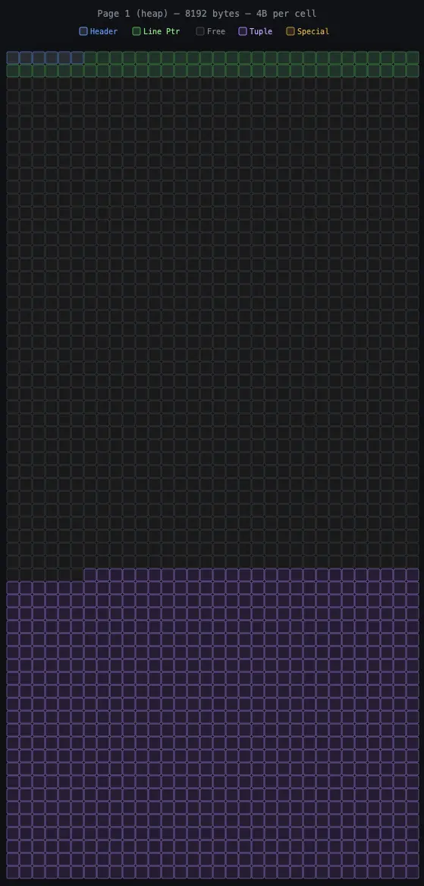

---

## 5. B-tree Index Pages

Open the `actor_pkey` file (the B-tree primary key index on `actor_id`).

### 5.1 Meta Page (Page 0)

Every B-tree starts with a meta page. Select page 0.

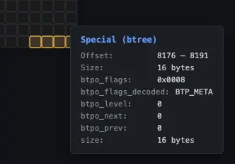

The orange cells at the bottom are the special region. Click on them to see
the B-tree meta data:

- `btm_root`: Which page is the root of the tree.
- `btm_level`: How many levels the tree has. With only 200 actors, the tree
  fits in a single level (root = leaf).

### 5.2 Leaf Page

Select page 1 (the root/leaf page). Compare it to the heap page:

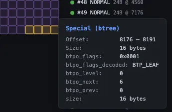

Key differences:

- **Orange cells at the bottom**: The 16-byte special region contains
  `BTPageOpaqueData` — sibling pointers (`btpo_prev`, `btpo_next`), tree
  level, and flags like `BTP_LEAF` and `BTP_ROOT`.
- **Smaller tuples**: Index tuples are much smaller than heap tuples. Each one
  contains only the indexed key (`actor_id`) and a TID pointing back to the
  heap.
- **More free space**: The green region is smaller relative to the page size
  because index entries are compact.

Click on an index tuple to see its detail:

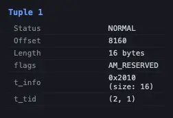

The `t_tid` field (e.g., `(0, 1)`) is the pointer back to the heap — "page 0,
line pointer 1" in the actor table.

---

## 6. Hash Index Pages

Open the `idx_hash_customer_email` file.

### 6.1 Meta Page

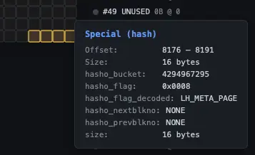

The hash meta page stores:

- `hashm_ntuples`: Total indexed tuples (599 customer emails).
- `hashm_ffactor`: Target tuples per bucket.
- `hashm_maxbucket`: Highest bucket number.

### 6.2 Bucket Page

Navigate to a bucket page (look for pages with type "hash" in the sidebar).

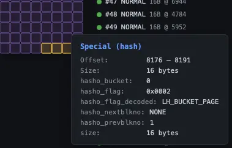

Hash pages have four types visible in the special region flags:
`LH_META_PAGE`, `LH_BUCKET_PAGE`, `LH_OVERFLOW_PAGE`, and `LH_BITMAP_PAGE`.
The magic number `0xFF80` in `hasho_page_id` identifies hash pages.

---

## 7. GiST Index Pages

Open the `film_fulltext_idx` file (GiST index on the film full-text column).

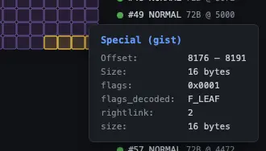

GiST-specific fields in the special region:

| Field | Meaning |
|-------|---------|
| `nsn` | Node Sequence Number — tracks page splits for concurrent access. |
| `rightlink` | Pointer to the right sibling page. |
| `flags` | `F_LEAF` for leaf pages, absent for internal nodes. |
| `gist_page_id` | Magic number `0xFF81`. |

GiST internal nodes store bounding keys that encompass all entries in their
subtree. Leaf nodes store the actual indexed values with TIDs pointing to heap
tuples.

---

## 8. GIN Index Pages

Open the `idx_gin_film_fulltext` file.

### 8.1 Meta Page

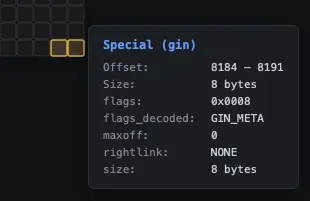

The GIN meta page reveals the index structure:

| Field | Meaning |
|-------|---------|
| `nEntries` | Number of distinct lexemes indexed. |
| `nEntryPages` | Pages in the entry tree (B-tree of keys). |
| `nDataPages` | Pages for posting trees (0 if all posting lists fit inline). |
| `nPendingPages` | Fast-inserted entries waiting to be merged. |

### 8.2 Entry Pages

Navigate to an entry page. GIN has a two-level structure:

1. An **entry tree** — a B-tree of keys (lexemes).
2. For each key, a **posting list** or **posting tree** of heap TIDs.

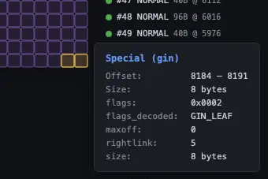

The `GIN_LEAF`, `GIN_DATA`, and `GIN_COMPRESSED` flags in the special region
tell you what kind of GIN page you're looking at.

---

## 9. BRIN Index Pages

Open the `idx_brin_rental_id` file. BRIN is the most space-efficient index
type — instead of indexing individual rows, it stores summary information for
ranges of consecutive heap pages.

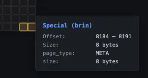

The meta page shows:

| Field | Meaning |
|-------|---------|
| `pagesPerRange` | How many heap pages each BRIN entry covers (default: 128). |
| `lastRevmapPage` | Location of the last range map page. |

BRIN has three page types:

- **Meta page** (page 0): Configuration.
- **Revmap pages**: Map from block range number to the summary tuple.
- **Regular pages**: Store the actual summary tuples (min/max values).

With `pagesPerRange = 128`, each BRIN entry covers about 1 MB of table data.
The entire BRIN index for the rental table fits in just 3 pages (24 KB) —
compare that to a B-tree on the same column which would need dozens of pages.

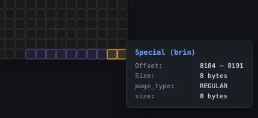

---

## 10. Exercises

Try these on your own to deepen your understanding:

1. **UPDATE and inspect**: Run `UPDATE actor SET first_name = 'UPDATED' WHERE actor_id = 1;`
   then `CHECKPOINT;`. Re-open the actor file and look at page 0. Find the old
   tuple with `HOT_UPDATED` and the new tuple with `HEAP_ONLY`. Notice how
   `t_ctid` on the old tuple points to the new one.

2. **Compare index sizes**: Open each index file and count the pages in the
   sidebar. Compare the BRIN index on `rental_id` (3 pages) with a B-tree on
   the same column. Why is BRIN so much smaller?

3. **Inspect after VACUUM**: Run `VACUUM actor;` then `CHECKPOINT;`. Re-open
   the actor file. Look for `XMIN_FROZEN` flags in tuple details and
   `REDIRECT`/`UNUSED` line pointer statuses.

4. **DELETE and observe dead tuples**: Delete a few rows, run `CHECKPOINT;`,
   and re-inspect. Find line pointers with `DEAD` status. Then run `VACUUM`,
   checkpoint again, and see them become `UNUSED`.

5. **Fill a page**: Insert enough rows into a small table to fill a page
   completely (no gray cells visible). Then insert one more row and watch
   PostgreSQL allocate a new page.
